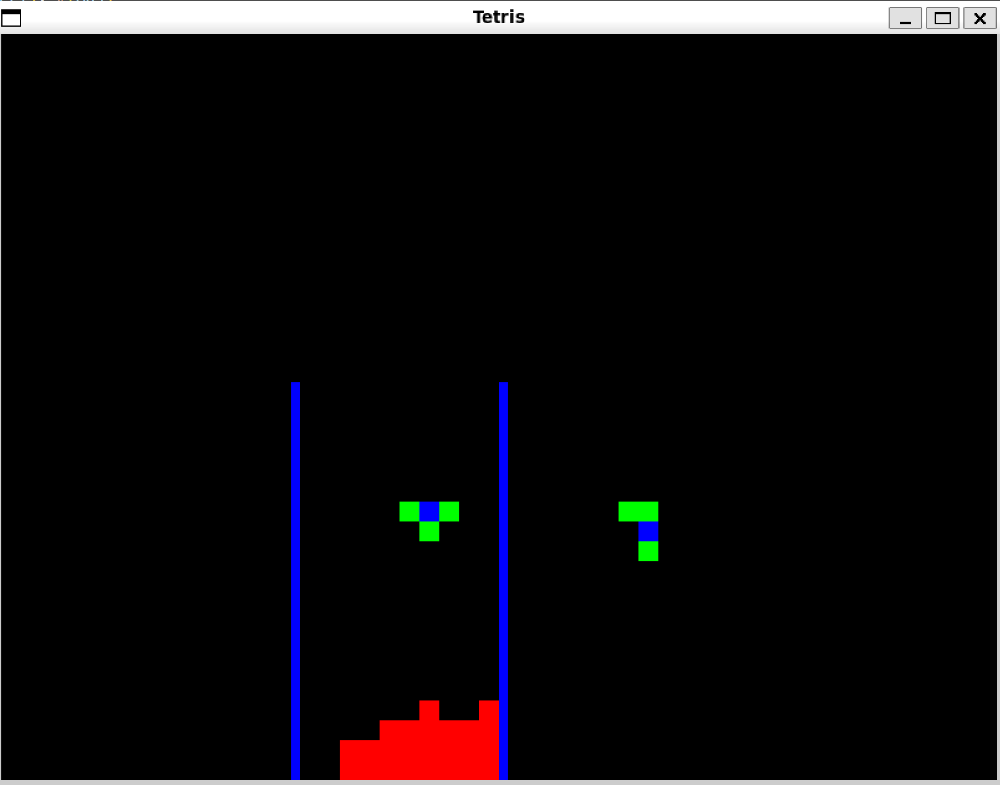

# Tetris

This is a simple Tetris game implemented in C++ using SDL for graphics and input handling.



## About

This project was inspired by a tutorial I saw on the web. The code structure, logic, and some implementation details are based on the concepts and examples provided in that tutorial, with some customizations and improvements.

## Features

- Classic Tetris gameplay
- Keyboard controls
- Graphical rendering using SDL
- Modular code structure (separate classes for game logic, board, pieces, and IO)

## Building

1. **Install dependencies** (on Ubuntu):

   ```sh
   sudo apt-get install libsdl2-dev libsdl2-gfx-dev
   ```

2. **Build the project:**

   ```sh
   make
   ```

   This will clean previous builds and compile the game into `build/tetris`.

3. **Run the game:**

   ```sh
   make run
   ```
   or
   ```sh
   ./build/tetris
   ```

## Controls

- **Arrow keys**: Move the piece left, right, and down
- **Z**: Rotate the piece
- **X**: Drop the piece instantly
- **ESC**: Quit the game

## Project Structure

```
.
├── include/      # Header files for classes (IO, board, pieces, tetris)
├── src/          # Source files for all classes and main logic
├── build/        # Compiled object files and final binary
├── Makefile      # Build instructions
└── README.md     # This file
```

## Credits

This project was inspired by a Tetris tutorial found on Javier López's [Website](https://javilop.com/). 